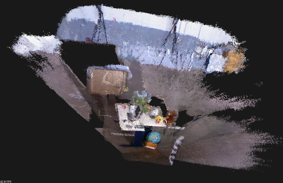

# rgbdslam_cg

RGBD-SLAM学习，根据高翔博客 [一起做RGB-D SLAM](https://www.cnblogs.com/gaoxiang12/tag/%E4%B8%80%E8%B5%B7%E5%81%9ARGB-D%20SLAM/)，其代码在 [gaoxiang12/rgbd-slam-tutorial-gx](https://github.com/gaoxiang12/rgbd-slam-tutorial-gx)

-----

# Build

```sh
mkdir build & cd build
cmake ..
make -j2
```

# Run

```sh
cd build

../bin/generate_pointcloud

../bin/detect_features

../bin/join_pointcloud

../bin/visual_odometry

../slam
```

<div align="center">
  
</div>
